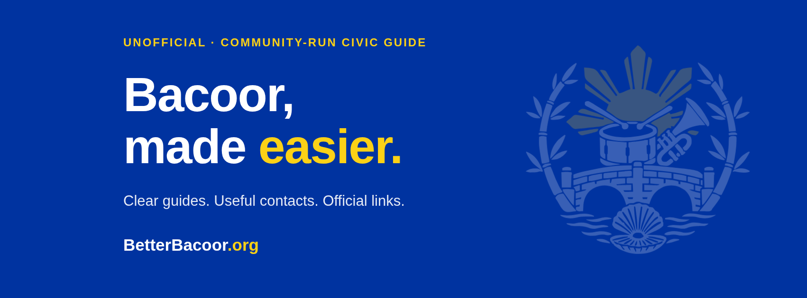

# BetterBacoor

**Bacoor, made easier.**

BetterBacoor is an open-source community guide for Bacoor, Cavite. It brings local services, practical guides, published contacts, and public information together so residents can find what they need and prepare for their next step.

Built for the community, with contributions welcome in code, research, design, accessibility, and Filipino translation.

[Contribute](CONTRIBUTING.md) · [Documentation](docs/README.md) · [Facebook](https://www.facebook.com/people/BetterBacoororg/61594400221717/) · [Better LGU community](https://lgu.bettergov.ph/)

> **Unofficial and community-run.** BetterBacoor is not operated by or endorsed by the City Government of Bacoor. Applications and payments go through official systems. Emergency tools provide reference information; BetterBacoor does not monitor incidents or dispatch help.

## What you can do

- **Read and prepare:** guides for business permits, civil registry copies, working permits, and Senior Citizen IDs, with saved checklists and printable instructions.
- **Find your service:** answer a few questions to find the relevant guide and application type.
- **Explore your barangay:** save a barangay choice, view published contacts and dated census figures, and resume your preparation checklists.
- **Browse local information:** schools, health services, garbage collection tables, and assistance-center locations are available through Directories, Services, and global search.
- **Get emergency information:** published hotlines and guidance for floods, fires, and other hazards, plus an emergency guide you can explicitly save for offline reference.
- **Read the Citizen’s Charter here:** an on-demand PDF reader with page navigation and extracted text, using an unmodified copy of the city’s published document.
- **Use English or Filipino:** switch languages without losing your current filters or checklist progress.

The current local-information collection includes **47 barangay profiles**, **19 health-service listings**, **44 school listings by education level**, and published garbage tables covering **33 barangays**, with five transcribed route summaries. School listings are not a count of distinct campuses. Garbage images are readable on-site but are not all transcribed or fully searchable. See [coverage and source limitations](docs/MY_BARANGAY.md).

## Information you can check

Service guidance and civic records link to their sources. Publication years, incomplete coverage, and known conflicts remain visible where they matter. A checked source is a dated reference, not a guarantee of current availability, eligibility, fees, or response time.

Contributors record source URLs, exact pages or table rows, and review dates. Automated checks validate supported content structures and freshness rules; they cannot establish that a phone connects, a facility is open, or a source is factually correct. Read the [content policy](docs/CONTENT_POLICY.md) before changing civic information.

## Run locally

Use **Node.js 22.13+ on the Node 22 line, or Node 24**, and **npm 10+**. CI uses Node 22. No API keys, database, or environment file are needed for the current app.

```bash
git clone https://github.com/0phl/betterbacoor.git
cd betterbacoor
npm ci
npm run dev
```

Open the local URL printed by Vite. External source links and remotely hosted garbage-table images need internet access. The Charter PDF is included in the repository and loads only when requested.

```bash
npm run check
npm audit --omit=dev --audit-level=high
npm run preview
```

`check` runs formatting, lint, tests, content and translation validation, TypeScript, and the production build. `preview` serves that build locally. Preview is not a production hosting service.

## Contribute

You do not need to be a developer to help. Check a source, improve a Filipino translation, review keyboard access, or suggest a clearer guide. For code and documentation changes, fork the repository and open a focused pull request.

- [Contribution guide](CONTRIBUTING.md): setup, source requirements, checks, and pull requests.
- [Report an issue](https://github.com/0phl/betterbacoor/issues/new/choose): incorrect information, bugs, or feature suggestions. GitHub requires an account; do not include private resident details.
- [Security policy](SECURITY.md): report sensitive vulnerabilities privately.

Repository issues are for improving BetterBacoor. Government applications, personal cases, and urgent incidents should go to the responsible office or emergency service.

## Project structure

| Location                        | Purpose                                                              |
| ------------------------------- | -------------------------------------------------------------------- |
| `src/pages/`, `src/components/` | Resident-facing pages and shared UI                                  |
| `src/data/`                     | Service guides, search, source adapters, and local preparation state |
| `src/i18n/`                     | English/Filipino language support                                    |
| `content/`                      | Source-controlled civic datasets and document provenance             |
| `scripts/`, `schemas/`          | Validation, offline-guide generation, and brand checks               |
| `public/`                       | Logo, original Charter PDF, static assets, and hosting rules         |
| `docs/`                         | Architecture, content rules, feature notes, and dated research       |

The app uses React, TypeScript, Vite, Tailwind CSS, Kapwa, and PDF.js. Search runs locally. Language preference, a selected barangay, and checklist progress stay in the browser; the current application has no resident accounts or application server. Only the explicitly saved emergency guide supports offline use. See [architecture](docs/ARCHITECTURE.md) and [offline behavior](docs/OFFLINE_AND_DIRECTORY.md).

## Deployment status

This repository is open for collaboration. Publishing the website is a separate release step: the current HTML still includes `noindex, nofollow`. Documentation updates do not change that setting or connect a public domain. See [deployment and release checks](docs/DEPLOYMENT.md) before launching.

## Credits and licensing

BetterBacoor continues a transferred project based on the [BetterLocalGov starter](https://github.com/iyanski/betterlocalgov), inspired by the [BetterGov.ph](https://bettergov.ph/) community. The original history and credits are preserved in [ACKNOWLEDGMENTS.md](ACKNOWLEDGMENTS.md).

New original software contributions use [MIT](LICENSE-MIT). Earlier CC0 releases and the starter retain their [CC0 1.0](LICENSE-CC0) permissions. Original non-software civic content continues under CC0 where contributors hold the relevant rights. Sourced documents, images, data, and dependencies keep their own terms. See the [licensing scope](docs/LICENSING.md) for details.
